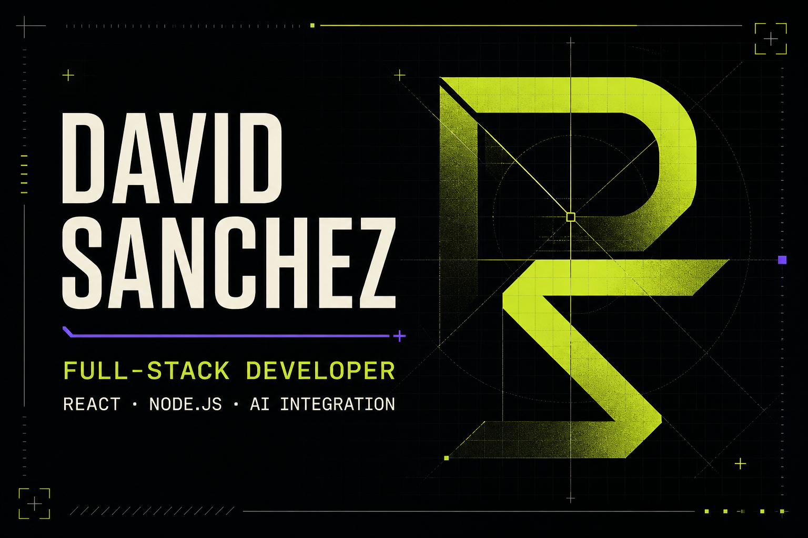

# David Sanchez — Developer Portfolio



A bilingual, responsive portfolio built to present my work as a full-stack developer. The experience combines an editorial interface with developer-console details, accessible interactions, and a system-aware color theme.

## Live portfolio

[david-sanchez-portfolio.dsancheztaba66.chatgpt.site](https://david-sanchez-portfolio.dsancheztaba66.chatgpt.site)

## Highlights

- Complete English and Spanish interface
- Light and dark themes with saved user preference
- Responsive layouts for desktop, tablet, and mobile
- Accessible navigation and reduced-motion support
- Selected case studies sourced from real repositories
- Custom Open Graph artwork for rich link previews

## Selected projects

- **NutriEdu** — Full-stack nutrition platform with authentication, dietary restriction filtering, meal planning, and transactional email.
- **Perfume Catalog** — Interactive React and TypeScript catalog with real-time search, filters, state management, and motion.
- **Task Manager API** — REST API demonstrating layered architecture, validation, CRUD workflows, and centralized error handling.

## Technology

- React 19
- TypeScript
- Vinext and Vite
- Tailwind CSS
- Cloudflare-compatible server output
- CSS animations and responsive design

## Run locally

Requirements: Node.js 22.13 or newer.

```bash
npm install
npm run dev
```

Open [http://localhost:3000](http://localhost:3000).

## Validate a production build

```bash
npm run build
```

## Contact

- Email: [dsancheztaba66@gmail.com](mailto:dsancheztaba66@gmail.com)
- GitHub: [@xrhon0s](https://github.com/xrhon0s)

---

Designed and developed by David Sanchez Tabarez.
